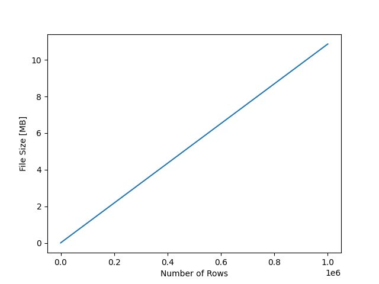

# Excel File Size

I wanted to know how excel files scale.

Results:

- File sizes scale linearly with row count (and fixed column count).
- With 10.000 entries, excel doesn't seem to discriminate between integers and floats (or Pandas writes them just as floats?), but strings seem to take up slightly more space.

